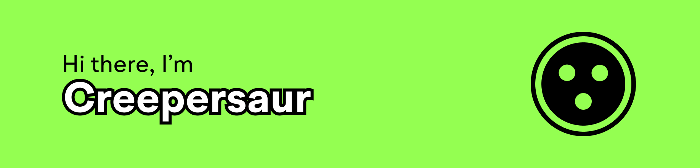

# I like making stuff!

- 🌍 I'm from India (🇮🇳)
- ✏️ I like making games and writing software and programming languages
- 🎮 My favorite games are Deltarune and Hollow Knight
- 🎓 I'm currently using **C#**, **Luau**, **JS/TS**, **Tauri**, **Godot**, and **Rust**
- 🔥 I'm currently working on [Ignite](https://github.com/creepersaur/ignite), a compiled programming language written in Rust 🦀
- 💻 Extra:
  - [Quark](https://github.com/creepersaur/quark), a reactive UI library written in Luau
  - [Macro Mage](https://github.com/creepersaur/Macro-Mage), a scripting langauge for writing automated keyboard/mouse input sequences
  - [CreeperCli](https://github.com/creepersaur/CreeperCLI-2), a filesystem linker backend for automatically syncing files to Roblox Studio
- Feel free to contribute to a project!

## Github Stats

